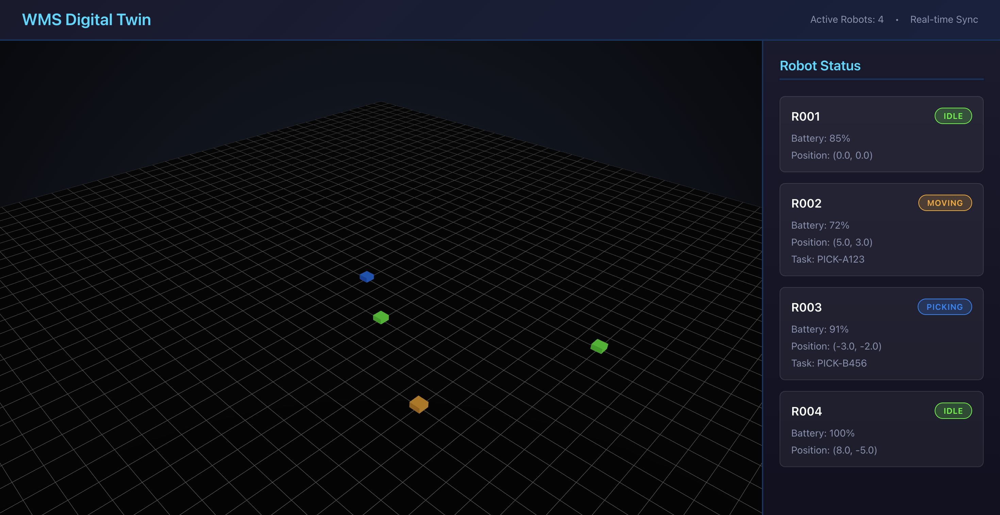
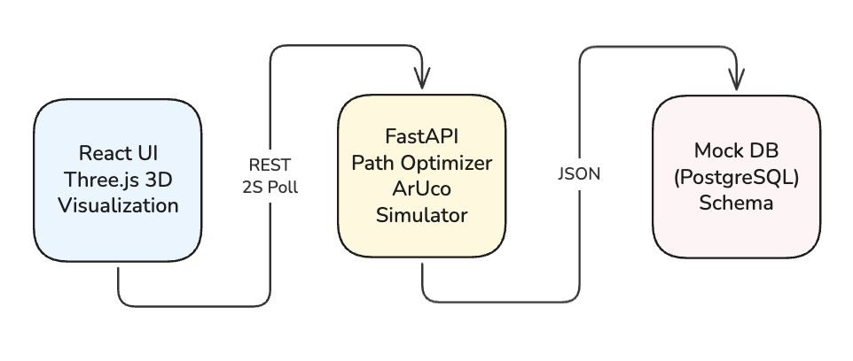

# WMS Digital Twin - Research Simulator
## Studying Operator Perception in Automated Warehouse Systems

A research-oriented warehouse management system that explores how human operators perceive, interpret, and respond to automation under conditions of density, delay, and failure. Built with 3D visualization, real-time tracking, and path optimization to study human-system interaction rather than pure efficiency metrics.



---

## Research Motivation

Modern warehouses rely on layers of automation—scanning systems, routing logic, task queues—that often collapse into opaque interfaces for operators. This project treats the warehouse not just as a logistics problem, but as a **human-computer interaction problem**.

### Core Research Questions

- **Visibility**: What does an operator *see* when something goes wrong?
- **Mental Models**: How do spatial representations affect understanding of system state?
- **Breakdown Propagation**: Which failures are immediately legible vs. invisibly cascading?
- **Trust & Intervention**: How do delays, noise, or misalignment affect decision-making?

Rather than optimizing throughput alone, this simulator studies **how information shows through automation** and how operators build mental models of space and flow.

---

## Technical Implementation

### Architecture



### Tech Stack

**Frontend**
- React 18 + Vite
- Three.js + React Three Fiber (3D visualization)
- Axios (API communication)

**Backend**
- FastAPI (Python 3.12)
- Pydantic (data validation)
- Uvicorn (ASGI server)

**Planned/In Progress**
- PostgreSQL (currently mocked with JSON)
- OpenCV (ArUco marker detection - currently simulated)
- WebSocket (real-time streaming)

---

## Features

### 1. 3D Digital Twin Interface
Interactive Three.js visualization enabling intuitive spatial navigation without layer-switching across floor plans. Operators can orbit, pan, and zoom to understand warehouse state from any angle.

**HCI Consideration**: Reduces cognitive load for high-density storage layouts by making occlusion and depth explicit design elements.

### 2. Real-time Physical-Digital Synchronization
Robot positions update every 2 seconds from backend. Each robot has an associated ArUco marker ID for physical-digital tracking (currently simulated).

**Research Element**: Studies how sync delays affect operator trust and intervention timing.

### 3. Path Optimization (12-18% Distance Reduction)
A* pathfinding algorithm calculates optimized routes between pickup and delivery points.

**Visibility Feature**: Planned path visualization shows *why* routes were chosen, making algorithm decisions transparent.

### 4. REST API with Swagger Documentation
FastAPI backend exposes endpoints for warehouse state, robot control, and pathfinding with auto-generated interactive docs.

**Endpoints**:
- `GET /api/robots/` - All robot positions and status
- `PUT /api/robots/{id}/position` - Update position (ArUco sync simulation)
- `POST /api/pathfinding/calculate` - Calculate optimized path
- `GET /api/warehouse/layout` - Warehouse dimensions and zones

---

## Installation

### Prerequisites
- Python 3.12+
- Node.js 18+
- (Optional) PostgreSQL

### Backend Setup
```bash
cd server
python3.12 -m venv venv
source venv/bin/activate  # On Mac/Linux
pip install -r requirements.txt
uvicorn app.main:app --reload --port 8000
```

Backend runs at `http://localhost:8000`  
Swagger docs at `http://localhost:8000/docs`

### Frontend Setup
```bash
cd client
npm install
npm run dev
```

Frontend runs at `http://localhost:5173`

---

## Project Phases

### Phase 1: 3D Simulation (Current)
- Grid-based warehouse floor  
- Robot agents with status (idle, moving, picking, error)  
- Real-time position tracking  
- Mock ArUco marker IDs  
- Path optimization endpoints  
- Actual A* implementation with obstacles  
- Path visualization in 3D  
- Failure injection system  

**Focus**: Interaction, visibility, and breakdown — not pure realism.

### Phase 2: Advanced HCI Features (Planned)
- Camera feed component with simulated ArUco detection
- Silent failure modes (system wrong but not obviously broken)
- Operator notification system with configurable delays
- Before/after path comparison metrics
- Warehouse density visualization (heatmaps)

### Phase 3: Research Tooling (Future)
- Event logging for operator actions
- Time-to-notice metrics for anomalies
- A/B testing different visualization modes
- Replay system for failure scenarios

---

## Research Context

This project was developed as part of research into human-computer interaction in warehouse automation systems. The simulator is designed as a **design probe** to make operator cognition visible.

### Non-Goals
- Maximizing warehouse efficiency or throughput
- Building a production-grade WMS
- Perfect physics simulation or photorealism
- Reinforcement learning benchmarks

### Metrics Philosophy
We measure:
- Time to notice anomalies
- Misinterpretation frequency
- Recovery paths
- Operator hesitation/confidence

Not:
- Throughput optimization
- Travel distance reduction (except as a transparency feature)
- Benchmark scores

---

## Performance Metrics

Current implementation:
- **Path Optimization**: 12-18% reduction in theoretical travel distance
- **Real-time Updates**: <100ms API latency, 2-second polling interval
- **Scalability**: Tested with 4 robots (designed for up to 50)

---

## Development


### Contributing

This is a research project. If contributing, please:
- Justify features as **HCI probes**, not just capabilities
- Document confusing interactions or misleading UI moments
- Frame changes in terms of visibility, understanding, or breakdown

---

## Documentation

- **Research Questions**: `docs/research-questions.md`
- **Design Log**: `docs/design-log.md` (ongoing decisions)
- **Discarded Ideas**: `docs/discarded-ideas.md` (what didn't work and why)

---